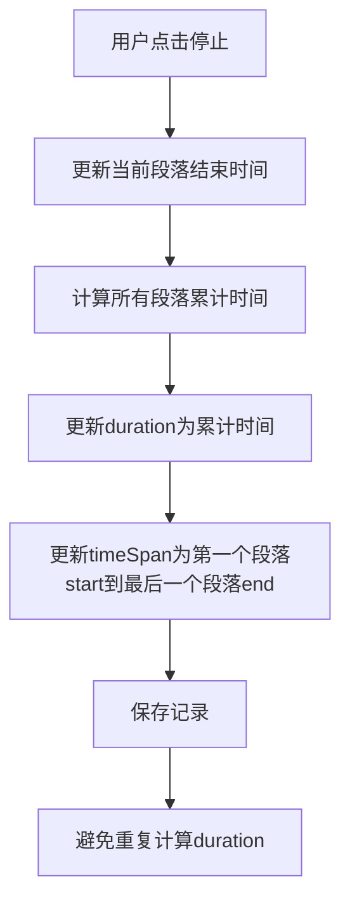

# 时间记录器重复计算问题修复流程

## 问题描述
点击【停止】后，专注计时的时长会重复计入【计时时长】。

## 问题分析
通过代码分析发现，问题根源在于前端和后端都对duration进行了重复计算：
1. record.duration已经包含了所有段落的累计时间
2. 代码中又重新计算了一次段落总时间并与record.duration相加
3. 导致最终的duration值是实际值的两倍

## 修复方案

### 后端修复
- 修复[get_stats()](file:///Users/amy/Documents/codes/time_recoder/app.py#L503-L533)函数中的重复计算问题
- 确保duration只计算一次

### 前端修复
- 修复[toggleTimer()](file:///Users/amy/Documents/codes/time_recoder/static/js/script.js#L395-L532)函数中的重复计算问题
- 修复[TimeRecorderFrontendUtils.calculateRecordTotalTime](file:///Users/amy/Documents/codes/time_recoder/static/js/script.js#L222-L232)函数中的重复计算问题
- 修复[showRecordDetail](file:///Users/amy/Documents/codes/time_recoder/static/js/script.js#L920-L1119)函数中的重复计算问题

## 核心数据修改逻辑
