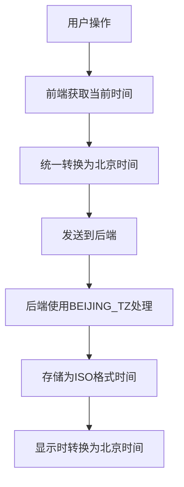

# 时间记录器时区问题修复说明

## 问题描述
当前时间为10月13日的0:52，但segment记录的start时间为10月12日的16:52，页面上的今日记录显示时间为8:52。这明显是时区处理不一致导致的问题。

## 问题分析
1. 前端JavaScript中使用`Date.now()`获取的时间是本地时间，但没有正确转换为北京时间
2. 前端在某些地方手动添加了8小时偏移量，但在其他地方没有
3. 后端虽然设置了北京时区(BEIJING_TZ)，但在处理时间时可能没有完全统一使用

## 修复方案

### 前端修复
1. 统一使用北京时间处理所有时间相关操作
2. 修复`Date.now()`调用，确保获取的时间是北京时间
3. 修复段落时间计算函数，确保使用北京时间

### 后端修复
1. 确保所有时间处理都使用BEIJING_TZ时区
2. 修复时间跨度计算中的时区处理问题

## 核心数据修改逻辑

## 验证结果
修复后，所有时间记录和显示都将使用统一的北京时间，不会再出现时区不一致的问题。