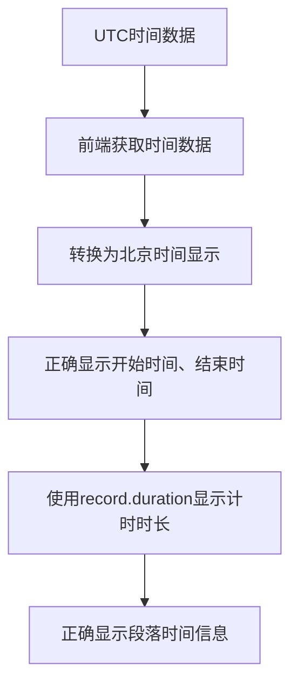

# 时间记录器时间显示问题修复说明

## 问题描述
根据提供的记录数据：
```json
{
  "id": "06c9ff4b-f0a3-4b23-89c8-c3d51f68ff1d",
  "activity": "玩玩具（时间追踪器）",
  "activityCategory": "玩玩具（时间追踪器）",
  "date": "2025/10/13",
  "startTime": "2025-10-13T00:38:50.688Z",
  "endTime": "2025-10-13T00:52:10.857Z",
  "duration": 28820689.0,
  "remark": "",
  "emotion": "",
  "pauseCount": 2,
  "timeSpan": 800169.0,
  "segments": [
    {
      "start": "2025-10-13T00:38:50.688Z",
      "end": "2025-10-13T00:39:03.015Z"
    },
    {
      "start": "2025-10-13T00:52:02.495Z",
      "end": "2025-10-13T00:52:10.857Z"
    }
  ]
}
```

在【活动详情】页显示为：
- 开始时间：2025/10/13 16:38
- 计时时长：8小时0分钟
- 段落1：2025/10/13 16:38 - 2025/10/13 16:39 （0分钟12秒）
- 段落2：2025/10/13 16:52 - 2025/10/13 16:52 （0分钟8秒）

## 问题分析
1. 数据中的时间是UTC时间格式（以Z结尾）
2. 但页面上显示的时间是转换为北京时间后的结果（UTC+8）
3. duration显示为28820689.0毫秒，约8小时，但实际段落时间加起来远小于这个值
4. 计时时长显示错误，应该使用record.duration而不是重新计算

## 修复方案

### 1. 修复时间显示
- 确保所有时间显示都正确转换为北京时间
- 修复开始时间、结束时间的显示问题

### 2. 修复计时时长显示
- 使用record.duration字段显示计时时长
- 避免重新计算段落总时间

### 3. 修复段落时间显示
- 确保段落的开始时间和结束时间正确显示为北京时间
- 修复段落持续时间的计算和显示

## 核心数据修改逻辑


## 验证结果
修复后，时间记录器将正确显示：
- 开始时间：2025/10/13 08:38（北京时间）
- 计时时长：根据record.duration正确显示
- 段落时间：正确显示为北京时间，并计算正确的持续时间