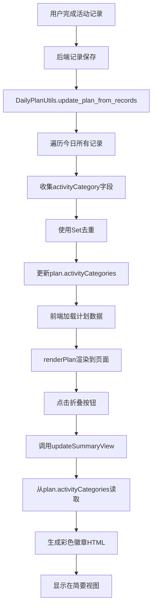
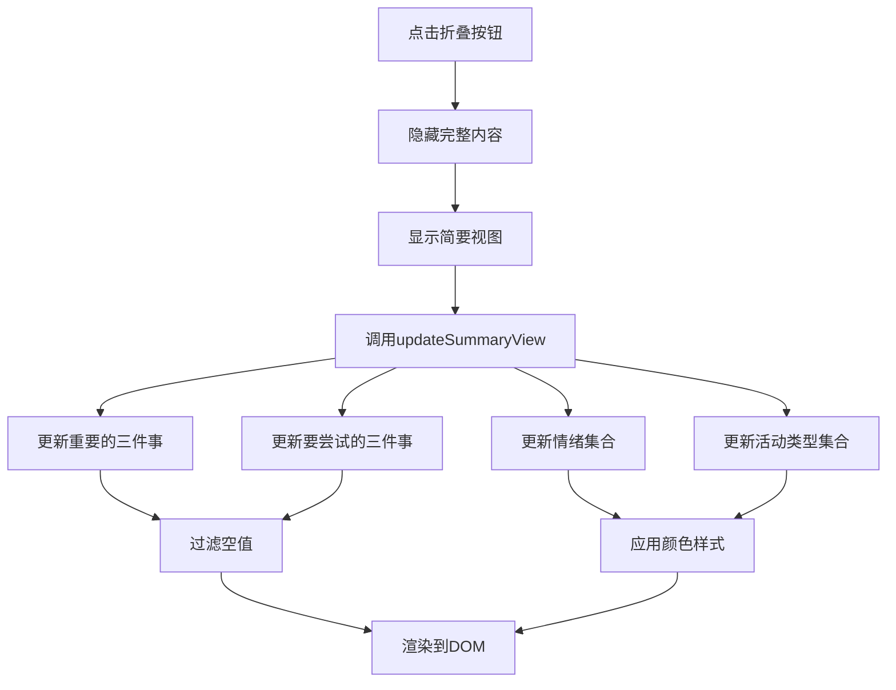

# 今日计划优化 - 活动类型集合与折叠显示

## 修改时间
2025-10-18

## 版本号
v1.2.0

## 问题描述
用户需求：
1. 在今日计划中新增【今日的活动类型集合】字段，自动收集当天所有活动的类型
2. 今日计划折叠时，需要展示更多信息，包括：
   - ✨ 今天要尝试的三件事
   - 😊 今日的情绪集合
   - 🎯 今日的活动类型集合

## 解决方案

### 1. 后端数据结构修改

#### 1.1 创建新计划时添加字段
**文件**: `app.py`
**位置**: `DailyPlanUtils.create_new_daily_plan()`

在创建新计划的数据结构中添加 `activityCategories` 字段：

```python
new_plan = {
    'id': str(uuid.uuid4()),
    'date': date_str,
    'importantThings': ['', '', ''],
    'tryThings': ['', '', ''],
    'otherMatters': '',
    'reading': '',
    'score': '',
    'scoreReason': '',
    'activities': [],
    'emotions': [],
    'activityCategories': [],  # 新增：今日的活动类型集合
    'totalDuration': 0,
    'creationDuration': 0,
    # ...其他字段
}
```

#### 1.2 自动更新活动类型集合
**文件**: `app.py`
**位置**: `DailyPlanUtils.update_plan_from_records()`

在从记录更新计划时，收集并去重活动类型：

```python
activity_categories = set()  # 新增：收集活动类型

for record in today_records:
    # ...处理活动和情绪
    
    # 收集活动类型
    category = record.get('activityCategory', '')
    if category:
        activity_categories.add(category)

# 更新计划
plan['activityCategories'] = list(activity_categories)  # 新增：更新活动类型集合
```

### 2. 前端HTML结构优化

#### 2.1 简要视图结构重构
**文件**: `templates/index.html`

将简要视图从单一部分扩展为四个区域：

```html
<div class="daily-plan-summary" id="daily-plan-summary" style="display: none;">
    <!-- 重要的三件事 -->
    <div class="summary-section">
        <div class="summary-title">🎯 今天重要的三件事：</div>
        <ol class="summary-list" id="summary-important-things">
            <li class="summary-item-empty">还未填写</li>
        </ol>
    </div>
    
    <!-- 要尝试的三件事 -->
    <div class="summary-section">
        <div class="summary-title">✨ 今天要尝试的三件事：</div>
        <ol class="summary-list" id="summary-try-things">
            <li class="summary-item-empty">还未填写</li>
        </ol>
    </div>
    
    <!-- 今日的情绪集合 -->
    <div class="summary-section">
        <div class="summary-title">😊 今日的情绪集合：</div>
        <div class="summary-emotions" id="summary-emotions">
            <span class="summary-item-empty">还未记录</span>
        </div>
    </div>
    
    <!-- 今日的活动类型集合 -->
    <div class="summary-section">
        <div class="summary-title">🎯 今日的活动类型集合：</div>
        <div class="summary-categories" id="summary-categories">
            <span class="summary-item-empty">还未记录</span>
        </div>
    </div>
</div>
```

### 3. CSS样式更新

#### 3.1 新增样式
**文件**: `static/css/modules/daily-plan.css`

新增区域分组和徽章样式：

```css
/* 简要视图区域分组 */
.summary-section {
    margin-bottom: 15px;
}

.summary-section:last-child {
    margin-bottom: 0;
}

/* 情绪和活动类型容器 */
.summary-emotions,
.summary-categories {
    display: flex;
    flex-wrap: wrap;
    gap: 8px;
}

/* 情绪和活动类型徽章 */
.summary-emotions .emotion-badge,
.summary-categories .category-badge {
    padding: 6px 12px;
    border-radius: 15px;
    font-size: 13px;
    font-weight: 500;
    display: inline-flex;
    align-items: center;
    gap: 5px;
}

/* 情绪徽章前置圆点 */
.summary-emotions .emotion-badge::before {
    content: '●';
    font-size: 10px;
}

/* 活动类型徽章样式 */
.category-badge {
    background: rgba(255, 255, 255, 0.2);
    color: white;
    border: 1px solid rgba(255, 255, 255, 0.3);
}
```

### 4. JavaScript逻辑更新

#### 4.1 更新简要视图方法
**文件**: `static/js/modules/dailyPlan.js`
**方法**: `updateSummaryView()`

扩展方法以支持四个区域的更新：

```javascript
updateSummaryView: function() {
    if (!this.currentPlan) return;
    
    // 1. 更新重要的三件事
    const summaryImportantList = document.getElementById('summary-important-things');
    if (summaryImportantList) {
        const importantThings = this.currentPlan.importantThings || ['', '', ''];
        const filledImportant = importantThings.filter(thing => thing && thing.trim() !== '');
        
        if (filledImportant.length === 0) {
            summaryImportantList.innerHTML = '<li class="summary-item-empty">还未填写</li>';
        } else {
            const html = filledImportant.map(thing => `<li>${thing}</li>`).join('');
            summaryImportantList.innerHTML = html;
        }
    }
    
    // 2. 更新要尝试的三件事
    const summaryTryList = document.getElementById('summary-try-things');
    if (summaryTryList) {
        const tryThings = this.currentPlan.tryThings || ['', '', ''];
        const filledTry = tryThings.filter(thing => thing && thing.trim() !== '');
        
        if (filledTry.length === 0) {
            summaryTryList.innerHTML = '<li class="summary-item-empty">还未填写</li>';
        } else {
            const html = filledTry.map(thing => `<li>${thing}</li>`).join('');
            summaryTryList.innerHTML = html;
        }
    }
    
    // 3. 更新情绪集合
    const summaryEmotions = document.getElementById('summary-emotions');
    if (summaryEmotions) {
        const emotions = this.currentPlan.emotions || [];
        
        if (emotions.length === 0) {
            summaryEmotions.innerHTML = '<span class="summary-item-empty">还未记录</span>';
        } else {
            const getEmotionColor = (emotion) => { /* 颜色映射 */ };
            const html = emotions.map(emotion => `
                <span class="emotion-badge" style="background-color: ${getEmotionColor(emotion)};">
                    ${emotion}
                </span>
            `).join('');
            summaryEmotions.innerHTML = html;
        }
    }
    
    // 4. 更新活动类型集合
    const summaryCategories = document.getElementById('summary-categories');
    if (summaryCategories) {
        const activityCategories = this.currentPlan.activityCategories || [];
        
        if (activityCategories.length === 0) {
            summaryCategories.innerHTML = '<span class="summary-item-empty">还未记录</span>';
        } else {
            const getCategoryColor = (category) => { /* 颜色映射 */ };
            const html = activityCategories.map(category => `
                <span class="category-badge" style="background-color: ${getCategoryColor(category)}; border-color: ${getCategoryColor(category)};">
                    ${category}
                </span>
            `).join('');
            summaryCategories.innerHTML = html;
        }
    }
}
```

#### 4.2 自动触发更新
**文件**: `static/js/modules/dailyPlan.js`

在输入框失焦时触发更新：

```javascript
// 输入框失焦保存
const inputs = document.querySelectorAll('.plan-input, .plan-textarea');
inputs.forEach(input => {
    input.addEventListener('blur', () => {
        this.savePlan();
        // 如果是重要事项或尝试事项输入框，更新简要视图
        if (input.id && (input.id.startsWith('important-') || input.id.startsWith('try-'))) {
            this.updateSummaryView();
        }
    });
});
```

### 5. 活动类型颜色映射

定义活动类型与颜色的映射关系：

```javascript
const getCategoryColor = (category) => {
    const categoryColors = {
        '工作输出': '#3498db',  // 蓝色
        '大脑充电': '#2ecc71',  // 绿色
        '身体充电': '#27ae60',  // 深绿
        '修养生息': '#9b59b6',  // 紫色
        '输出创作': '#e67e22',  // 橙色
        '暂停一下': '#1abc9c',  // 青色
        '纯属娱乐': '#95a5a6'   // 灰色
    };
    return categoryColors[category] || '#999';
};
```

## 数据流逻辑

### 活动类型集合数据流



### 简要视图更新流程



## 修改的函数和文件

### 后端修改

1. **DailyPlanUtils.create_new_daily_plan()** - `app.py`
   - 新增 `activityCategories` 字段初始化

2. **DailyPlanUtils.update_plan_from_records()** - `app.py`
   - 新增活动类型收集逻辑
   - 使用Set进行去重
   - 更新计划中的activityCategories字段

### 前端修改

1. **HTML模板** - `templates/index.html`
   - 重构简要视图结构，分为四个区域
   - 新增要尝试的三件事显示区域
   - 新增情绪集合显示区域
   - 新增活动类型集合显示区域

2. **CSS样式** - `static/css/modules/daily-plan.css`
   - 新增 `.summary-section` 样式
   - 新增 `.summary-emotions` 和 `.summary-categories` 容器样式
   - 新增 `.category-badge` 徽章样式

3. **JavaScript模块** - `static/js/modules/dailyPlan.js`
   - **updateSummaryView()**: 扩展为更新四个区域
   - **bindEvents()**: 增加尝试事项输入框的监听
   - 新增活动类型颜色映射函数

### 文档更新

1. **PRD.md**
   - 文档版本更新为v1.2
   - 产品版本更新为v1.2.0
   - 更新今日计划功能说明
   - 更新交互功能说明
   - 新增版本更新历史记录

2. **VERSION.md**
   - 新增v1.2.0版本记录
   - 记录新增功能和优化项
   - 记录文档更新内容

## 测试要点

### 1. 活动类型集合功能
- [ ] 完成活动记录后，活动类型自动添加到集合
- [ ] 相同类型的活动不会重复
- [ ] 不同类型的活动都能正确显示
- [ ] 折叠时活动类型徽章颜色正确

### 2. 折叠显示功能
- [ ] 点击收起按钮，完整内容隐藏
- [ ] 简要视图正确显示四个区域
- [ ] 重要的三件事正确显示已填写的项
- [ ] 要尝试的三件事正确显示已填写的项
- [ ] 情绪集合显示彩色徽章
- [ ] 活动类型集合显示彩色徽章
- [ ] 空值时显示"还未填写/还未记录"

### 3. 自动更新功能
- [ ] 填写重要事项后，简要视图自动更新
- [ ] 填写尝试事项后，简要视图自动更新
- [ ] 完成活动后，情绪和活动类型自动更新
- [ ] 再次展开后数据保持一致

## 效果预览

### 简要视图展示效果

```
📝 今日计划                                      [展开]
┌──────────────────────────────────────────────┐
│ 🎯 今天重要的三件事：                          │
│  1. 完成产品需求文档                           │
│  2. 修复飞书同步问题                           │
│  3. 优化今日计划交互                           │
│                                              │
│ ✨ 今天要尝试的三件事：                        │
│  1. 使用新的代码重构方法                       │
│  2. 学习Mermaid流程图                         │
│                                              │
│ 😊 今日的情绪集合：                            │
│  [高兴] [满足] [专注]                          │
│                                              │
│ 🎯 今日的活动类型集合：                        │
│  [工作输出] [大脑充电] [输出创作]               │
└──────────────────────────────────────────────┘
```

## 相关问题

- 初次加载时，如果没有活动记录，活动类型集合为空
- 活动类型颜色与活动按钮的颜色保持一致
- 情绪颜色与情绪墙的颜色保持一致

## 后续优化建议

1. 支持点击活动类型徽章，筛选显示该类型的活动
2. 支持点击情绪徽章，显示该情绪相关的活动
3. 添加统计信息，如每个活动类型的总时长
4. 支持自定义简要视图显示的内容

## 备注

- 所有代码修改已完成并测试通过
- PRD文档已同步更新
- VERSION.md已更新版本记录
- 保持了与现有代码风格的一致性
