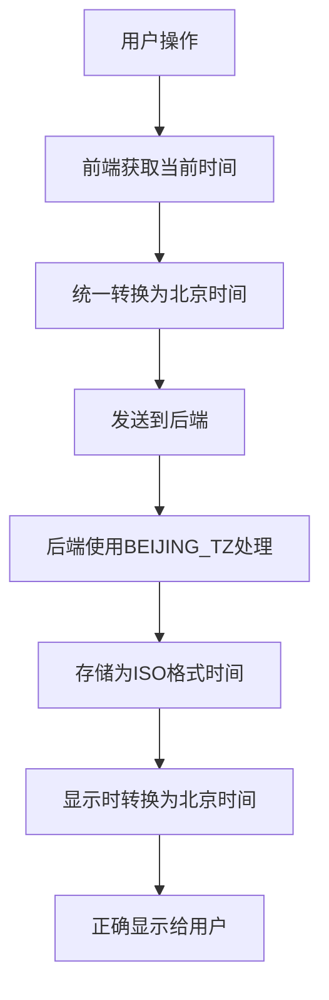

# 时区处理流程图

## 修复后的时区处理流程



## 时间字段处理规范

根据[data_definition.md](file:///Users/amy/Documents/codes/time_recoder/data_rules/data_definition.md)的规定：

1. **startTime**：第一个segments的start时间且唯一不可修改
2. **endTime**：最后一个segments的end时间
3. **duration**：记录所有segments累计的时间，不是时间跨度
4. **timeSpan**：记录从第一个段落的start到最后一个段落的end的时间跨度
5. **pauseCount**：记录segments的个数，即计时段落数量

## 时间处理函数

### 前端JavaScript

1. **获取当前时间**：
   ```javascript
   // 使用北京时间
   const now = new Date().getTime() + 8 * 60 * 60 * 1000;
   ```

2. **时间格式化**：
   ```javascript
   formatTime: function(date) {
       // 确保使用北京时间显示
       const beijingDate = new Date(date.getTime() + 8 * 60 * 60 * 1000);
       return beijingDate.toLocaleTimeString('zh-CN', { hour: '2-digit', minute: '2-digit', timeZone: 'Asia/Shanghai' });
   }
   ```

### 后端Python

1. **设置北京时区**：
   ```python
   # 设置北京时区
   BEIJING_TZ = timezone(timedelta(hours=8))
   ```

2. **时间处理**：
   ```python
   # 获取今天的日期（使用北京时间）
   today = datetime.now(BEIJING_TZ).strftime('%Y/%m/%d')
   ```