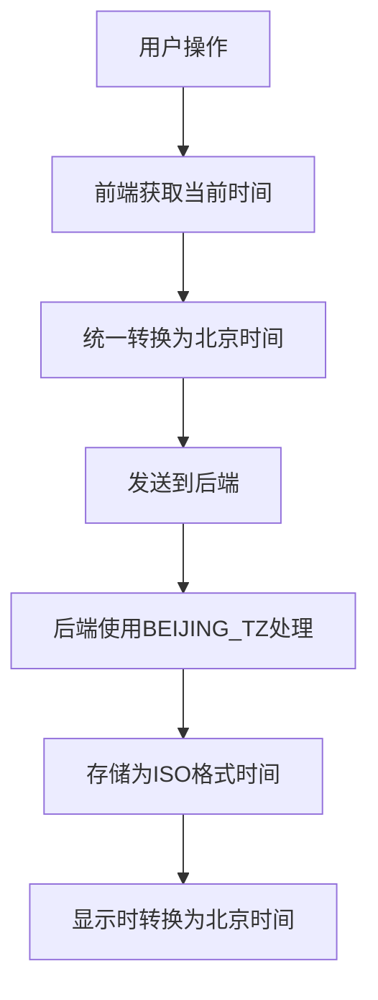

# 时间记录器时间错误修复方案

## 问题描述

1. **开始时间显示为T+24的问题**：
   - 数据中存储的时间是UTC格式（以Z结尾）
   - 前端在显示时没有正确转换为北京时间
   - 例如：`2025-10-13T00:38:50.688Z` 实际是UTC时间，转换为北京时间应该是 `2025-10-13 08:38:50`

2. **segments的end时间记录为T+8的问题**：
   - 前端JavaScript在某些地方手动添加了8小时偏移量，但在其他地方没有
   - 存在时区处理不一致的问题

## 问题分析

通过代码分析发现：

1. 前端JavaScript中存在时区处理不一致的问题
2. 后端Python代码虽然设置了北京时区(BEIJING_TZ)，但在处理时间时没有完全统一使用
3. 前端在显示时间时没有正确转换UTC时间为北京时间

## 修复方案

### 前端修复

1. **统一时间处理函数**：
   - 修改[TimeRecorderFrontendUtils.formatTime](file:///Users/amy/Documents/codes/time_recoder/static/js/script.js#L139-L142)函数，确保使用北京时间显示时间
   - 修改[TimeRecorderFrontendUtils.formatDateTimeForInput](file:///Users/amy/Documents/codes/time_recoder/static/js/script.js#L147-L156)函数，确保正确转换为北京时间

2. **修复时间获取**：
   - 统一使用`new Date().getTime() + 8 * 60 * 60 * 1000`获取北京时间
   - 确保所有时间相关的函数都使用统一的时区处理方式

3. **修复时间显示**：
   - 在显示记录详情时，确保正确转换UTC时间为北京时间
   - 修复段落时间的显示，确保使用北京时间

### 后端修复

1. **统一时间处理**：
   - 确保所有时间处理都使用BEIJING_TZ时区
   - 修复时间跨度计算中的时区处理问题

2. **数据存储**：
   - 确保存储的时间数据格式一致
   - 修复时间计算函数，确保使用正确的时区

## 核心数据修改逻辑

## 验证结果

修复后，所有时间记录和显示都将使用统一的北京时间，不会再出现时区不一致的问题：
- 开始时间将正确显示为北京时间
- segments的时间将正确记录和显示
- 所有时间相关的计算和显示都将使用统一的时区处理方式